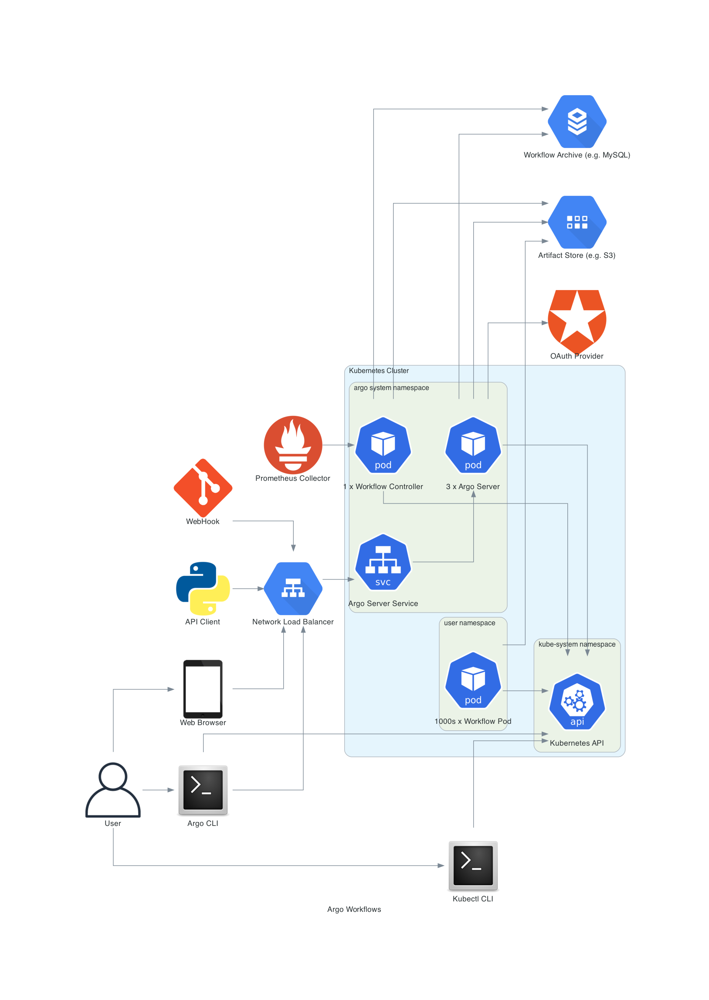
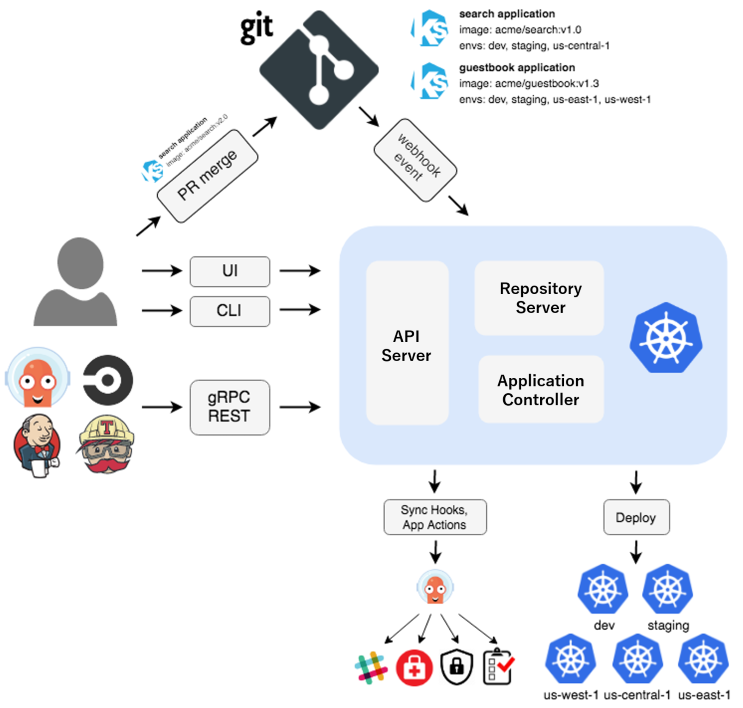
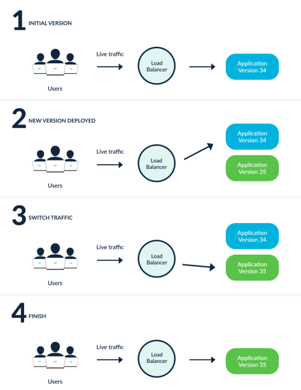
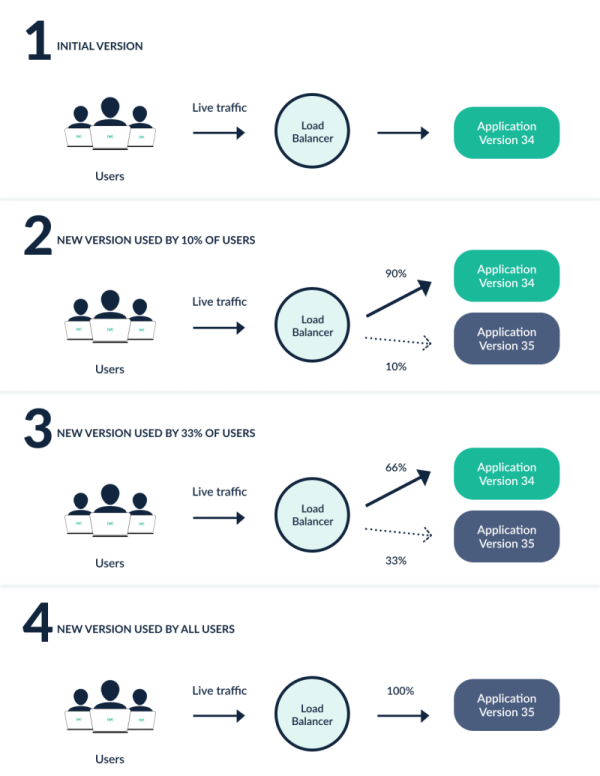
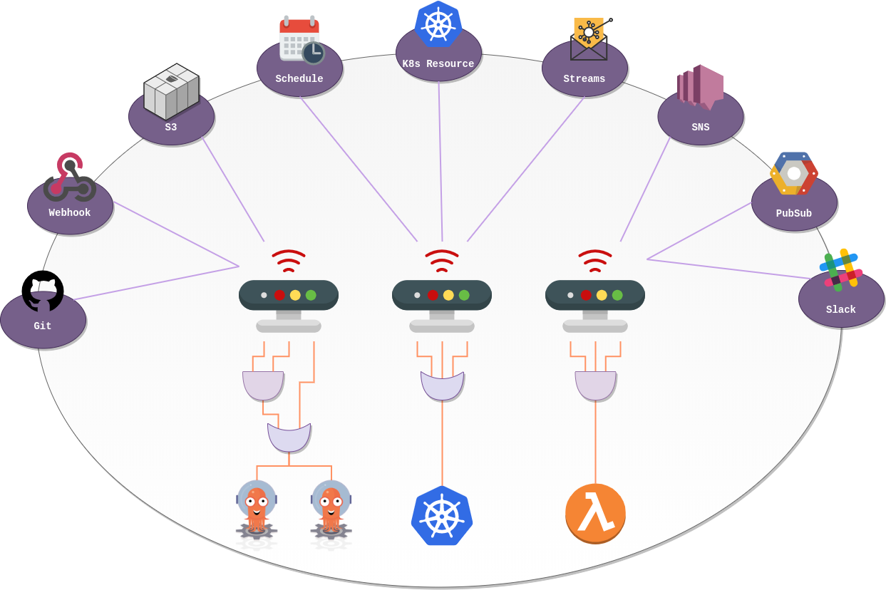

- [🧠 Exam Overview](#-exam-overview)
  - [📊 Exam Topic Breakdown](#-exam-topic-breakdown)
    - [🚀 Argo Workflows — 36%](#-argo-workflows--36)
    - [⚙️ Argo CD — 34%](#️-argo-cd--34)
    - [🔄 Argo Rollouts — 18%](#-argo-rollouts--18)
    - [⚡ Argo Events — 12%](#-argo-events--12)
- [Argo Workflows 36%](#argo-workflows-36)
  - [Generating and Consuming Artifacts](#generating-and-consuming-artifacts)
    - [📦 Generating and Consuming Artifacts (Argo Workflows)](#-generating-and-consuming-artifacts-argo-workflows)
    - [🔄 How It Works](#-how-it-works)
    - [📤 Generating Artifacts (Outputs)](#-generating-artifacts-outputs)
    - [📥 Consuming Artifacts (Inputs)](#-consuming-artifacts-inputs)
    - [🔗 Simple Flow](#-simple-flow)
    - [🗄️ Storage Optimization](#️-storage-optimization)
    - [⚙️ Advanced: Conditional Artifacts](#️-advanced-conditional-artifacts)
    - [🧠 Key Takeaways](#-key-takeaways)
  - [🧩 Understanding Argo Workflow Templates](#-understanding-argo-workflow-templates)
    - [🔄 Why Use Workflow Templates?](#-why-use-workflow-templates)
    - [⚙️ How They Work](#️-how-they-work)
    - [🔗 Example Concept](#-example-concept)
  - [📍 Scope (Very Important for Exam)](#-scope-very-important-for-exam)
    - [🟡 Namespace Scoped](#-namespace-scoped)
    - [🌍 Cluster Scoped](#-cluster-scoped)
    - [🧠 Key Differences](#-key-differences)
    - [🧠 Key Takeaways](#-key-takeaways-1)
    - [⚠️ Common Exam Focus](#️-common-exam-focus)
  - [Understand the Argo Workflow Spec](#understand-the-argo-workflow-spec)
    - [🔑 Key Fields to Know](#-key-fields-to-know)
    - [⚙️ Variables \& Parameters](#️-variables--parameters)
    - [📊 Metrics](#-metrics)
    - [🔁 Retry Strategy](#-retry-strategy)
    - [🧠 Key Takeaways](#-key-takeaways-2)
    - [⚠️ Exam Focus](#️-exam-focus)
  - [Work with DAG (Directed-Acyclic Graphs)](#work-with-dag-directed-acyclic-graphs)
    - [Key Characteristics of DAG-based Workflows](#key-characteristics-of-dag-based-workflows)
  - [Run Data Processing Jobs with Argo Workflows](#run-data-processing-jobs-with-argo-workflows)
    - [🔹 How It Works](#-how-it-works-1)
    - [⚙️ Example Concept](#️-example-concept)
    - [🧠 Key Takeaways](#-key-takeaways-3)
- [Argo CD 34%](#argo-cd-34)
  - [What is Argo CD?](#what-is-argo-cd)
  - [Core Concepts](#core-concepts)
  - [Argo CD Architecture](#argo-cd-architecture)
  - [How Argo CD Works](#how-argo-cd-works)
  - [Synchronize Applications with Argo CD](#synchronize-applications-with-argo-cd)
    - [Argo CD Sync Phases \& Sync Waves – Complete Overview](#argo-cd-sync-phases--sync-waves--complete-overview)
    - [1. Sync Phases](#1-sync-phases)
    - [2. Sync Waves](#2-sync-waves)
    - [Argo CD Sync Waves – Numbering \& Priority Explained](#argo-cd-sync-waves--numbering--priority-explained)
    - [Core Rule (most important thing to remember)](#core-rule-most-important-thing-to-remember)
    - [Wave Number Examples \& Conventions](#wave-number-examples--conventions)
    - [Complete Example: Backend First → Frontend Later](#complete-example-backend-first--frontend-later)
  - [Use Argo CD Application](#use-argo-cd-application)
    - [Argo CD Projects (AppProject)](#argo-cd-projects-appproject)
    - [Why Projects are Important](#why-projects-are-important)
    - [Key Fields Explained](#key-fields-explained)
  - [Argo CD Application (Core Resource)](#argo-cd-application-core-resource)
    - [Questions may ask](#questions-may-ask)
  - [Multiple Sources (Argo CD ≥ 2.6)](#multiple-sources-argo-cd--26)
    - [ApplicationSet (Advanced Scaling)](#applicationset-advanced-scaling)
- [Argo Rollouts (18%)](#argo-rollouts-18)
  - [Overview](#overview)
- [Core Concepts](#core-concepts-1)
  - [CI vs CD vs Progressive Delivery (PD)](#ci-vs-cd-vs-progressive-delivery-pd)
  - [Architecture Basics](#architecture-basics)
  - [Argo Rollouts Blue-Green Deployment Explained](#argo-rollouts-blue-green-deployment-explained)
    - [1. What is Blue-Green Deployment in Argo Rollouts?](#1-what-is-blue-green-deployment-in-argo-rollouts)
    - [2. Key Components in Your YAML](#2-key-components-in-your-yaml)
    - [3. How Active vs Preview Service Works](#3-how-active-vs-preview-service-works)
    - [4. Step-by-Step Flow When You Update the Image](#4-step-by-step-flow-when-you-update-the-image)
    - [5. How Services Connect to the Pods](#5-how-services-connect-to-the-pods)
    - [6. Important Points About Your Specific YAML](#6-important-points-about-your-specific-yaml)
  - [2. Canary Deployment](#2-canary-deployment)
    - [Key Fields in `strategy.canary`:](#key-fields-in-strategycanary)
  - [Strategy Comparison](#strategy-comparison)
  - [Key Implementation Notes](#key-implementation-notes)
  - [Argo Rollouts Canary with NGINX Ingress + HPA](#argo-rollouts-canary-with-nginx-ingress--hpa)
    - [Traffic Shift Strategy](#traffic-shift-strategy)
  - [Why Two Services?](#why-two-services)
  - [How Traffic Shifting Actually Works (with NGINX)](#how-traffic-shifting-actually-works-with-nginx)
  - [Key Intelligent Things Argo Does for You](#key-intelligent-things-argo-does-for-you)
  - [Argo Rollouts - Blue-Green vs Canary \& Analysis](#argo-rollouts---blue-green-vs-canary--analysis)
    - [Analysis \& Automated Verification](#analysis--automated-verification)
    - [AnalysisTemplate](#analysistemplate)
    - [AnalysisRun](#analysisrun)
- [Argo Events (12%)](#argo-events-12)
- [Overview](#overview-1)
  - [Core Concepts](#core-concepts-2)
    - [Event-Driven Architecture (EDA)](#event-driven-architecture-eda)
  - [Argo Events Architecture \& Components](#argo-events-architecture--components)
    - [1. EventSource](#1-eventsource)
    - [2. Sensor](#2-sensor)
    - [3. EventBus](#3-eventbus)
    - [4. Trigger](#4-trigger)
  - [Important Configuration Details](#important-configuration-details)
    - [Webhook Event Source Security](#webhook-event-source-security)
    - [Event Filtering \& Validation](#event-filtering--validation)
  - [Typical Event Flow](#typical-event-flow)
- [Exam Focus Areas (12% weight)](#exam-focus-areas-12-weight)


The CAPA exam is designed for beginners who are new to Argo and its suite of tools, which includes:

* Argo Workflows
* Argo CD
* Argo Rollouts
* Argo Events

But be warned… even though it says it’s for beginners, it can be a bit intimidating if you’ve never worked with these tools before.

So in this study guide, I’ll try to cover key topics you should be familiar with and include some resources and practical exercises to help you prepare for the exam.

## 🧠 Exam Overview

Good news: the exam is multiple choice, so it’s not as rigorous as Kubernetes exams where you have to perform tasks in a live server environment.

However, you are expected to have a solid understanding of how to use these tools, including detailed knowledge of some of their **Custom Resource Definition (CRD)** specifications.

* ⏱️ Duration: 90 minutes
* 📜 Validity: 2 years
* 🔁 Retake: 1 free retake if you don’t pass

### 📊 Exam Topic Breakdown

#### 🚀 Argo Workflows — 36%

* Understand Argo Workflow fundamentals
* Generate and consume artifacts
* Understand Argo Workflow templates
* Understand the Argo Workflow spec
* Work with DAG (Directed Acyclic Graphs)
* Run data processing jobs with Argo Workflows
* Practice

#### ⚙️ Argo CD — 34%

* Understand Argo CD fundamentals
* Synchronize applications with Argo CD
* Use Argo CD Application
* Configure Argo CD with Helm and Kustomize
* Identify common reconciliation patterns
* Practice

#### 🔄 Argo Rollouts — 18%

* Understand Argo Rollouts fundamentals
* Use common progressive rollout strategies
* Describe AnalysisTemplate and AnalysisRun
* Practice

#### ⚡ Argo Events — 12%

* Understand Argo Events fundamentals
* Understand Argo Event components and architecture
* Practice


Let’s now dig into each of the topics and provide high-level summaries of what you should know for each section.

I’ll also include some resources and practical exercises to help you prepare for the exam 💪

## Argo Workflows 36%
Argo Workflows is an open-source cloud-native workflow engine for orchestrating jobs on Kubernetes. Like all the other projects in the Argo suite it’s implemented as an extension to Kubernetes following the Operator pattern and provides a powerful way to define complex workflows using YAML.

Understand Argo Workflow Fundamentals
When you install Argo Workflows, you get a Workflow Controller which is reponsible for reconciling the desired state of the Workflow CRD and an Argo Server which is responsible for serving the API requests.

Here is a high-level overview of the Argo Workflow architecture:

<p align="center">
  
</p>

[Source](https://argo-workflows.readthedocs.io/en/latest/architecture)

The Workflow CRD is the primary resource you will interact with to define your workflows. It allows you to define a sequence of tasks and dependencies between tasks. It also is reponsible for storing the state of the workflow.

Argo Workflows is an open-source, Kubernetes-native workflow engine designed to run and manage multi-step, container-based pipelines (also called workflows) on Kubernetes clusters.

- You define a sequence of tasks (or a complex graph of tasks).
- Each task runs inside its own container (like a Docker/OCI image).
- Kubernetes handles running these containers as Pods.
- Argo orchestrates everything: order, parallelism, dependencies, retries, failures, passing data between steps, etc.

The Workflow spec contains the following key attributes:

- entrypoint is the name of the template that will be executed first
- templates is a list of templates that define the tasks in the workflow

[Check out this ](https://github.com/argoproj/argo-workflows/blob/main/examples/template-defaults.yaml)

The template is where tasks are defined to be run in the workflow. A template can be one of the following task types:

- container is a task that runs a container. This is useful when you want to run a task that is already containerized.
- script is a task that gives you a bit of flexibility to run a script inside a container. This is useful when you need to run a script but don’t want to create a separate container image.
- resource is a task that allows you to perform operations on cluster resources. This can be used to get, create, apply, delete, replace, or patch resources. This is useful when you need to interact with Kubernetes resources.
- suspend is a task that allows you to pause the workflow until it is manually resumed. This is useful when you need to wait for a manual approval or intervention.
- plugin is a task that allows you to run an external plugin. This is useful when you need to run a task that is not supported by the built-in templates.
- containerset is a task that allows you to run multiple containers within a single pod. This is useful when you need to run multiple containers that share the same network namespace, IPC namespace, and PID namespace.
- http is a task that allows you to make HTTP requests. This is useful when you need to interact with external services.

You can also control the order in which tasks are run with template invocators. This defines the execution flow of the workflow and there are two types of invocators:

- steps is a of tasks that are executed in order. Steps can be nested to create a hierarchy of tasks and outer steps are run sequentially while inner steps are run in parallel. However, you can get more control over the execution of the inner steps by - using the synchronization field.
  
- dag is a directed acyclic graph of templates that are executed based on dependencies. This is useful when you need to run tasks in parallel and define dependencies between tasks; especially when you tasks that rely on the output of other tasks.

### Generating and Consuming Artifacts
Artifacts can be consumed by tasks or be outputs of tasks which in turn can be consumed by other tasks.

[Check out](https://github.com/argoproj/argo-workflows/blob/main/examples/artifact-passing.yaml) this example of a workflow that generates and consumes artifacts

#### 📦 Generating and Consuming Artifacts (Argo Workflows)

In Argo Workflows, **artifacts** are files or data that are produced by one task and can be used by another task.

Think of artifacts as a way to **pass data between steps** in your workflow.


#### 🔄 How It Works

* A task can **generate (output)** an artifact
* Another task can **consume (input)** that artifact

👉 This allows you to create **data pipelines** inside your workflow.


#### 📤 Generating Artifacts (Outputs)

To create an artifact in a task, use the `outputs.artifacts` field.

* You define:

  * `name` → identifier of the artifact
  * `path` → where the file is located inside the container

**Example concept:**

* Task A generates a file `/tmp/output.txt`
* It exposes this file as an artifact

#### 📥 Consuming Artifacts (Inputs)

To use an artifact in another task, use the `inputs.artifacts` field.

* You define:

  * `name` → artifact name
  * `path` → where it will be available in the container

👉 If the artifact comes from another task, you reference it like:

* **Task name + artifact name**

So:

* Task B can consume the output of Task A


#### 🔗 Simple Flow

```
Task A (generate file) → Task B (use file)
```

#### 🗄️ Storage Optimization

Artifacts are usually stored in an **artifact repository**, such as:

* S3
* MinIO
* GCS

To avoid storing too much data:

* Use **artifact repositories**
* Enable **garbage collection** to clean up unused artifacts

#### ⚙️ Advanced: Conditional Artifacts

You can control **when an artifact should be created** using conditions.

👉 This is useful when:

* You only want to store results **if a task succeeds or fails**
* Or based on some expression


#### 🧠 Key Takeaways

* Artifacts = data passed between tasks
* `outputs.artifacts` → create artifact
* `inputs.artifacts` → use artifact
* Use repositories + GC for optimization
* Supports conditional logic for advanced use cases

This is a core concept in Argo Workflows and is often tested in CAPA, especially around:

* Task dependencies
* YAML structure
* Data flow between steps


### 🧩 Understanding Argo Workflow Templates

**Workflow Templates** in Argo are **reusable workflow definitions**.

Instead of writing the same workflow logic again and again, you can define it once as a template and reuse it across multiple workflows.

[Check out this example of workflow templates](https://github.com/argoproj/argo-workflows/blob/main/examples/workflow-template/templates.yaml)

#### 🔄 Why Use Workflow Templates?

They are useful when:

* You have **common tasks or pipelines**
* You want to **avoid duplication**
* You want to **standardize workflows**

👉 Think of them like reusable blueprints.


#### ⚙️ How They Work

* A **WorkflowTemplate** is a separate Kubernetes resource
* It contains the same structure as a normal Workflow
* But it is **not executed directly** (unless explicitly triggered)

Instead:

* A **Workflow references the template**
* And executes it


#### 🔗 Example Concept

```id="5gk8qz"
Workflow → calls → WorkflowTemplate
```

👉 For example:

* You define a template called `random-fail-template`
* Your Workflow calls this template to run it


### 📍 Scope (Very Important for Exam)

#### 🟡 Namespace Scoped

* `WorkflowTemplate`
* Available **only within a specific namespace**


#### 🌍 Cluster Scoped

* `ClusterWorkflowTemplate`
* Available **across all namespaces**

👉 Use this when:

* Multiple teams or apps need the same template


#### 🧠 Key Differences

| Type                    | Scope        | Use Case                          |
| ----------------------- | ------------ | --------------------------------- |
| WorkflowTemplate        | Namespace    | App/team-specific reuse           |
| ClusterWorkflowTemplate | Cluster-wide | Shared across multiple namespaces |

#### 🧠 Key Takeaways

* Workflow Templates = reusable workflows
* Referenced by Workflows (not always run directly)
* Helps reduce duplication and improve consistency
* Two types:

  * Namespace-scoped (`WorkflowTemplate`)
  * Cluster-scoped (`ClusterWorkflowTemplate`)

#### ⚠️ Common Exam Focus

* How a Workflow references a template
* Difference between Workflow vs WorkflowTemplate
* Namespace vs cluster scope

This is a **frequently tested CAPA topic**, especially around:

* Reusability
* YAML structure
* Resource types

### Understand the Argo Workflow Spec

The **Workflow Spec** in Argo defines the behavior of a workflow. For the CAPA exam, you may get questions on various fields in the spec, so it’s important to understand what they do.

#### 🔑 Key Fields to Know

| Field                   | Purpose                                                                   |
| ----------------------- | ------------------------------------------------------------------------- |
| `activeDeadlineSeconds` | Maximum time the workflow can run before it’s automatically terminated    |
| `arguments`             | Input parameters for the workflow or templates                            |
| `metrics`               | Define workflow-level metrics to monitor performance                      |
| `retryStrategy`         | Configure how tasks are retried if they fail                              |
| `synchronization`       | Control how tasks synchronize (e.g., locks to prevent parallel execution) |
| `templateDefaults`      | Default values for templates in the workflow                              |
| `workflowTemplateRef`   | Reference to a WorkflowTemplate to reuse workflow logic                   |


#### ⚙️ Variables & Parameters

* Workflows can **accept parameters** (variables) which are passed to tasks or templates.
* Use `arguments` for inputs and `parameters` in templates.
* Example:

```yaml id="argo-vars1"
arguments:
  parameters:
  - name: message
    value: "Hello Argo"
```


#### 📊 Metrics

* You can track metrics for each task or the workflow as a whole.
* Useful for monitoring workflow performance in production or testing.
* Supported metrics: **counter, gauge, histogram**.


#### 🔁 Retry Strategy

* Retry strategy helps handle **task failures** automatically.
* You can configure:

  * **Limit** → max retries
  * **Retry policy** → `Always`, `OnFailure`, `OnError`
  * **Backoff** → wait time between retries

Example:

```yaml id="argo-retry1"
retryStrategy:
  limit: 3
  retryPolicy: "OnFailure"
  backoff:
    duration: "10s"
    factor: 2
    maxDuration: "1m"
```

> Tip: Always understand the difference between `limit` and `retryPolicy` — this is commonly tested.


#### 🧠 Key Takeaways

* Workflow Spec controls **how the workflow runs**
* Pay attention to:

  * Time limits (`activeDeadlineSeconds`)
  * Parameters (`arguments`)
  * Metrics for monitoring
  * Retry strategies and policies
  * Template references (`workflowTemplateRef`)

#### ⚠️ Exam Focus

* Recognize spec fields in YAML
* Understand how retries and policies work
* How to configure workflow-level and task-level metrics
* How variables/parameters flow through the workflow

This topic is essential because **task failures and monitoring are common in real workflows**, and the exam often tests your understanding of these behaviors.

### Work with DAG (Directed-Acyclic Graphs)

DAG is important to understand as it allows you to define dependencies between tasks in a workflow. Tasks without dependencies (steps) are run in parallel while tasks with dependencies are run sequentially. If you have tasks that rely on the output of other tasks, you’ll want to use a DAG.

[Check out this sample workflow that uses a DAG](https://github.com/argoproj/argo-workflows/blob/main/examples/workflow-template/dag.yaml)

In Argo Workflows, a DAG is a way to define task dependencies in a workflow.

- Tasks without dependencies → run in parallel
- Tasks with dependencies → run sequentially, following the order defined in the DAG

Use a DAG when:
- Some tasks depend on the output of other tasks
- You want efficient parallel execution for independent tasks

**What is it?**

A Directed Acyclic Graph (DAG) is a visual model representing a sequence of tasks where:
- Directed: Relationships flow one way (A → B means A must run before B).
- Acyclic: No circular dependencies (you cannot loop back to a previous task).
- Graph: Tasks are nodes; dependencies are the lines connecting them.

**Why is it useful?**

DAGs power modern orchestration tools (like Airflow or Argo Workflows) because they solve three big problems:
- Order: Automatically ensures tasks run in the correct sequence based on dependencies.
- Speed: Runs independent tasks in parallel automatically.
- Resilience: If a task fails, you can retry only that task—not the whole pipeline.

#### Key Characteristics of DAG-based Workflows 

- Directed: Tasks flow one way (A → B means A runs before B).
- Acyclic: No loops or circular dependencies—workflow always ends.
- Dependency-driven: Tasks only run when all upstream dependencies succeed.
- Parallel execution: Independent tasks run simultaneously.
- Deterministic: Same input always produces same execution order.
- Fault isolation: Failures affect only specific tasks (retry without restarting whole pipeline).
- Observability: Visual graph shows status of every task.
- Topological order: Tasks execute in mathematically correct sequence.

### Run Data Processing Jobs with Argo Workflows

One of the **common use cases** for Argo Workflows is **data processing**.

You can use Argo Workflows to:

* Fetch data from various sources
* Transform or process the data
* Store the results in artifact repositories or databases

#### 🔹 How It Works

1. **Data Sources**

   * Point to artifact repositories (local or cloud)
   * Examples: S3, MinIO, GCS
   * Workflows fetch the data from these sources

2. **Data Transformation**

   * Use expressions to **process or transform** the fetched data
   * Can include filtering, calculations, formatting, or combining artifacts

3. **Storing Results**

   * Output data as artifacts to repositories
   * Can be consumed by other tasks or workflows

#### ⚙️ Example Concept

```text id="argo-data-flow1"
Fetch Data → Transform Data → Store Results
```

* Task 1: Fetch data from S3
* Task 2: Transform the data using expressions
* Task 3: Save the output as artifacts or push to a repository

#### 🧠 Key Takeaways

* Argo Workflows is **well-suited for data pipelines**
* Supports **external data sources** like S3
* Transformation can be done using **expressions**
* Artifacts allow results to be **passed to other tasks**

> Tip: For CAPA, focus on **how data flows through tasks**, how **artifacts are used**, and **configuring sources and transformations**.
[Check out this example of a workflow that processes data](https://github.com/argoproj/argo-workflows/blob/main/examples/data-transformations.yaml)

## Argo CD 34%

### What is Argo CD?

- **Argo CD** is a **declarative, continuous delivery tool** for Kubernetes.
- Implements **GitOps principles**:
  - Git repository = **source of truth** for application state.
  - Ensures Kubernetes clusters reflect Git-defined desired state.
- Manages the **full lifecycle** of applications in Kubernetes.

### Core Concepts

| Concept                  | Description |
| ------------------------ | ----------- |
| **Application**          | Collection of Kubernetes resources representing your app. Defined as an **Application CRD**. |
| **Application Source Type** | Tool used to manage the app (e.g., Helm, Kustomize). |
| **Target State**         | Desired state defined in Git repository. |
| **Live State**           | Actual state of the application running in the cluster. |
| **Sync**                 | Action that applies target state to live state. |
| **Sync Status**          | Indicates whether target state and live state match. |
| **Sync Operation Status** | Status of the **last sync operation**. |
| **Refresh**              | Action to compare live state with target state. |

### Argo CD Architecture

- Follows the **Operator pattern** as a Kubernetes extension.
- **Key components:**
  - **API Server** → handles Argo CD requests
  - **Repository Server** → communicates with Git
  - **Controller** → monitors applications and applies syncs
  - **Dex (optional)** → authentication
  - **Application CRD** → declarative definition of an app
- Provides **observability**, **auditability**, and **automatic syncing**.

<p align="center">
  
</p>


### How Argo CD Works

1. Define your application in Git using manifests or Helm/Kustomize charts.
2. Argo CD monitors the repository for changes.
3. Compares **target state** (Git) with **live state** (cluster).
4. Syncs the cluster to match Git automatically or manually.
5. Provides feedback through **UI, CLI, or API**.


### Synchronize Applications with Argo CD

Sync Phases and Sync Waves are two complementary mechanisms in Argo CD that give you fine-grained control over when and in what order resources (including hooks) are applied during a sync operation. They solve real-world problems where Kubernetes' default parallel/near-parallel apply fails due to dependencies, timing races, or external side-effects (e.g., CRD registration, database readiness, operator reconciliation).

#### Argo CD Sync Phases & Sync Waves – Complete Overview

Sync Phases and Sync Waves are the two main mechanisms Argo CD uses to control **ordering**, **timing**, and **dependencies** during application synchronization.

#### 1. Sync Phases

Phases define the **major stages** of a sync operation.  
They are mainly used for **resource hooks** (Jobs/Pods that run before, during, or after the main apply), but normal resources can also be assigned to phases.

| Phase       | Hook Annotation                              | When it executes                                      | Typical Use Cases                                      | Waits for previous phase? | Health check required? |
|-------------|----------------------------------------------|-------------------------------------------------------|--------------------------------------------------------|----------------------------|------------------------|
| **PreSync** | `argocd.argoproj.io/hook: PreSync`           | Before any main (Sync) resources are applied          | Database migrations, schema init, backups, validation  | —                          | Yes (for hooks)        |
| **Sync**    | `argocd.argoproj.io/hook: Sync` <br>*(or no hook annotation = default)* | Main apply phase – together with normal manifests     | Deployments, Services, ConfigMaps, StatefulSets, etc.  | Yes (after PreSync)        | Yes (for progression)  |
| **PostSync**| `argocd.argoproj.io/hook: PostSync`          | After **all** Sync resources are applied **and healthy** | Smoke tests, integration tests, notifications, cleanup | Yes (after Sync healthy)   | Yes                    |
| **Skip**    | `argocd.argoproj.io/hook: Skip`              | Never applied                                         | Temporarily disable broken/blocking resources          | —                          | —                      |
| **SyncFail**| `argocd.argoproj.io/hook: SyncFail`          | If the overall sync fails                             | Failure alerts, rollback cleanup, notifications        | Only on failure            | —                      |

**Key rules about phases:**
- Executed **sequentially**: PreSync → Sync → PostSync
- Argo CD **waits** for a phase to complete successfully before starting the next
- Hooks are usually Jobs (must exit 0 to succeed)
- Normal resources without hook annotation → **Sync** phase
- Phases control **lifecycle hooks**, not fine-grained resource ordering

#### 2. Sync Waves

Waves provide **intra-phase ordering** — they let you control the sequence **inside** a phase (most commonly inside **Sync** phase).

```yaml
metadata:
  annotations:
    argocd.argoproj.io/sync-wave: "-10"   # any integer: negative, zero, positive
```

#### Argo CD Sync Waves – Numbering & Priority Explained

Argo CD treats sync wave numbers **purely as ordering values**:

- **Lower number** → applied **earlier**  
- **Higher number** → applied **later**

#### Core Rule (most important thing to remember)

- Argo CD always processes waves **from lowest number to highest number** (ascending order).  
- **Negative numbers** come **before** zero.  
- **Positive numbers** come **after** zero.

#### Wave Number Examples & Conventions

| Wave number example | When it runs (in the same phase) | Typical use case (common convention)                          | Why people choose this number                              |
|----------------------|----------------------------------|----------------------------------------------------------------|------------------------------------------------------------|
| -20, -15, -10       | Very early                       | Super foundational things:<br>• CRDs<br>• Namespaces<br>• RBAC / ClusterRoles<br>• StorageClasses<br>• Operators | Negative = "before everything else" — gives maximum breathing room |
| -5, -1              | Early                            | • Databases / StatefulSets<br>• PVCs<br>• Early init / migration Jobs | Still before default (0) but after ultra-low infrastructure |
| **0**               | Default / middle                 | • ConfigMaps<br>• Secrets<br>• Services<br>• Core infrastructure | No annotation = automatically 0 — most people start here   |
| 5, 10, 15           | Later                            | • Deployments<br>• StatefulSets (the actual application pods) | After configs & services exist                             |
| 20, 30, 50, 100     | Very late                        | • Ingress<br>• HPA / HorizontalPodAutoscaler<br>• Monitoring resources (ServiceMonitor, PrometheusRule)<br>• Canary steps<br>• Tests / notifications | Only after app is running & healthy                        |

#### Complete Example: Backend First → Frontend Later

- Wave 0 (or low positive): Backend API (Deployment + Service)
- Wave 10–20: Frontend UI (Deployment + Service, Ingress if any)

[Sync Phases and Waves](https://argo-cd.readthedocs.io/en/stable/user-guide/sync-waves/)


### Use Argo CD Application
Before we get into the Argo CD Application, you should know that Argo Projects are used to group applications and manage access control. This is useful when you need to manage multiple applications and control who has access to them. Argo CD comes with a default project called default and most beginners will deploy applications to this project. However, as your team grows and you have more applications, you may want to create additional projects to manage access control and restrict where applications can be deployed from, what applications can be deployed, and what clusters and namespaces they can be deployed to.

Check out this [example of how to define a project](https://argo-cd.readthedocs.io/en/stable/operator-manual/declarative-setup/#projects) and the various fields that can be configured.


#### Argo CD Projects (AppProject)

What is a Project?

An AppProject in Argo CD is a logical boundary used to:
- Group multiple applications
- Enforce security policies
- Control who can deploy what and where

#### Why Projects are Important
As environments scale (multiple teams, clusters, apps), you need control over:

- Which Git repositories are allowed
- Where applications can be deployed
- Which Kubernetes resources are permitted
- Who has access (RBAC)
- Without Projects → no isolation, no governance

#### Key Fields Explained
- sourceRepos: Defines allowed Git repositories
- clusterResourceWhitelist: Allows cluster-level resources
- finalizers: Prevents deleting project if apps still exist

### Argo CD Application (Core Resource)
What is an Application?

The Application CRD is the core object in Argo CD, It defines:

- What to deploy → source → Git / Helm / Kustomize
- Where to deploy → destination → Kubernetes cluster

#### Questions may ask
- What happens if namespace doesn't exist?
- How to enable auto-sync?

### Multiple Sources (Argo CD ≥ 2.6)
Concept: Single Application → multiple Git sources

#### ApplicationSet (Advanced Scaling)
What is ApplicationSet?

An extension of Application that allows:

- Creating multiple Applications automatically
- Managing multi-cluster deployments


## Argo Rollouts (18%)

### Overview
Argo Rollouts is a **Kubernetes-native progressive delivery** tool that extends the standard `Deployment` resource with advanced deployment strategies.

- It is implemented as a **Kubernetes controller** with its own **Custom Resource Definitions (CRDs)**.  
- It enables **Blue-Green**, **Canary**, and other progressive delivery strategies to reduce deployment risk.

**Key Capabilities:**
- Advanced deployment strategies (Blue-Green & Canary)
- Automated traffic routing (via Service, Ingress, or Service Mesh)
- Automated analysis and rollback using metrics
- Drop-in replacement or companion to Kubernetes Deployment

---

## Core Concepts

### CI vs CD vs Progressive Delivery (PD)

- **Continuous Integration (CI)**: Frequently integrate code changes, build, and test to detect issues early.
- **Continuous Delivery (CD)**: Reliably deploy applications to production on demand.
- **Progressive Delivery (PD)**: An evolution of CD that focuses on **gradual, controlled** release of features to minimize risk.  
  Includes feature flags, A/B testing, and phased rollouts.

Argo Rollouts primarily enables **Progressive Delivery**.

### Architecture Basics
- **Argo Rollouts Controller**: Watches `Rollout` resources and manages their lifecycle.
- **Rollout**: The main CRD (replaces or works alongside `Deployment`).
- **ReplicaSet & Pods**: Managed by the Rollout controller (adds version awareness).
- Integrates with **Service**, **Ingress**, and **Service Meshes** for traffic shifting.


### Argo Rollouts Blue-Green Deployment Explained

Here's a clear, step-by-step explanation of how your Argo Rollouts Blue-Green deployment works, including the roles of active and preview services, and how everything connects.

#### 1. What is Blue-Green Deployment in Argo Rollouts?

Blue-Green is a zero-downtime deployment strategy.  
You always have two versions of your app running at the same time (the old "blue" and the new "green").  
Only one version receives real user (production) traffic at any moment.  
You can fully test the new version before instantly switching all traffic to it.

Argo Rollouts manages this automatically by controlling **ReplicaSets** (not normal Deployments) and by **dynamically updating the selectors** on your Services.

```yaml
apiVersion: argoproj.io/v1alpha1
kind: Rollout
metadata:
  name: blue-green-app
  namespace: default
spec:
  replicas: 3
  selector:
    matchLabels:
      app: blue-green-app
  template:
    metadata:
      labels:
        app: blue-green-app
    spec:
      containers:
      - name: blue-green-container
        image: nginx:1.23
        ports:
        - containerPort: 80
  strategy:
    blueGreen:
      activeService: blue-green-app-active
      previewService: blue-green-app-preview
      autoPromotionEnabled: false
---
apiVersion: v1
kind: Service
metadata:
  name: blue-green-app-active
  namespace: default
spec:
  selector:
    app: blue-green-app
  type: LoadBalancer
  ports:
  - port: 80
    targetPort: 80
---
apiVersion: v1
kind: Service
metadata:
  name: blue-green-app-preview
  namespace: default
spec:
  selector:
    app: blue-green-app
  type: LoadBalancer
  ports:
  - port: 80
    targetPort: 80
```

#### 2. Key Components in Your YAML

| Component              | Name                        | Purpose |
|------------------------|-----------------------------|---------|
| Rollout                | blue-green-app              | The main resource (replaces a normal Deployment) |
| Active Service         | blue-green-app-active       | Receives **production / live traffic** |
| Preview Service        | blue-green-app-preview      | Used to **test the new version** before it goes live |
| Pod Template Label     | app: blue-green-app         | All pods (old + new) get this label |

Both services have **exactly the same selector** (`app: blue-green-app`) and the same `type: LoadBalancer`.

#### 3. How Active vs Preview Service Works

Argo Rollouts does **not** use the service selector the way a normal Kubernetes Service does.

Instead, the Argo Rollouts controller **automatically adds a special label** (usually something like `rollouts-pod-template-hash`) to the pods of each ReplicaSet and then **updates the service selectors** to point to the correct hash.

- **Active Service** (`blue-green-app-active`):  
  Always points to the **current live version** (the "blue" or stable ReplicaSet).  
  This is what your users / ingress / load balancer should point to.

- **Preview Service** (`blue-green-app-preview`):  
  Points to the **new version** (the "green" ReplicaSet) while it is being tested.  
  You can access this service separately to do manual testing, smoke tests, canary traffic, etc., without affecting production.

#### 4. Step-by-Step Flow When You Update the Image

Let's say you change the image from `nginx:1.23` to `nginx:1.25` and apply the Rollout again.

1. Argo Rollouts detects the change in `.spec.template`.
2. It creates a **new ReplicaSet** (let's call it "green" – revision 2) with 3 replicas.
3. The **preview service** is immediately updated to point to the new green pods.  
   You can now visit the **preview LoadBalancer IP** and see the new nginx version.
4. The **active service** continues pointing to the old blue pods (**no downtime**).
5. The rollout **pauses** because you have `autoPromotionEnabled: false`.
6. You test the preview service thoroughly (manual checks, automated tests, etc.).
7. When you're happy, you **manually promote** the rollout using:
```bash
   kubectl argo rollouts promote blue-green-app
```
8. On Promotion
- The active service is instantly updated to point to the **green pods**
- All production traffic switches to the new version **atomically (zero downtime)**
- After a short delay (`scaleDownDelaySeconds`, default: 30s), the old **blue ReplicaSet** is scaled down to 0

#### 5. How Services Connect to the Pods
Even though both services have the same selector in your YAML:
```yaml
selector:
  app: blue-green-app
```
Argo Rollouts overrides this at runtime by adding a hash-based selector:

- Active service selector becomes: app: blue-green-app, rollouts-pod-template-hash: <old-hash>
- Preview service selector becomes: app: blue-green-app, rollouts-pod-template-hash: <new-hash>

#### 6. Important Points About Your Specific YAML

- `autoPromotionEnabled: false` → Manual promotion required (safe for production).
- Both services are `type: LoadBalancer` → Each gets its own public IP (or cloud load balancer).
- In real setups, people usually point their DNS / Ingress only to the active service.
- Preview service is used only for testing (you can even make it `ClusterIP` if you don't need external access).
- `Replicas: 3` → Both old and new versions will run with 3 pods during the transition.
- No `scaleDownDelaySeconds` defined → Uses default (30 seconds).


<p align="center">
  
</p>


### 2. Canary Deployment

New version is released to a small percentage of users first. Traffic is gradually increased if the new version performs well.  If issues are found, traffic is reduced (rollback).

<p align="center">
  
</p>

**Use Case:** High-traffic applications where risk must be minimized.

#### Key Fields in `strategy.canary`:

- **steps**  
  List of progressive steps for rollout

- **setWeight**  
  Percentage of traffic sent to the new version

- **pause**  
  Manual or timed pause between steps (for observation/approval)

- **analysis**  
  Automated verification using metrics (e.g., success rate, latency)

- **trafficRouting**  
  Used for integrating with Service Mesh or Ingress (Istio, NGINX, etc.)

```yaml
spec:
  strategy:
    canary:
      steps:
      - setWeight: 10
      - pause: {}
      - setWeight: 30
      - analysis:
          templateName: success-rate
      - setWeight: 100
```

**Argo Rollouts Only**

- Releases the new version to a **small subset of users** initially (e.g., 5-10% of traffic).
- **Progressive traffic shifting**:
  - Traffic is incrementally increased through defined steps (e.g., 10% → 25% → 50% → 100%).
  - Each step can be gated by manual approval, automated metrics, or time-based pauses.

- **Observability & automation**:
  - Real-time metrics (latency, error rates, custom business KPIs) determine whether to proceed or rollback.
  - If metrics degrade at any step, Argo Rollouts **automatically aborts** and rolls back.
  - Analysis can run continuously in the background throughout the rollout.

- **Fine-grained control**:
  - **Step-based weights**: Define exact traffic percentages per step.
  - **Manual gates**: Pause for human verification (e.g., QA sign-off, executive approval).
  - **Duration pauses**: Wait a specified time between steps for smoke testing.
  - **Traffic router flexibility**: Works with service meshes (Istio, Linkerd), ingress controllers (NGINX), or multiple Kubernetes Services.

- **Best for**: High-risk applications, microservices with complex dependencies, or when you need to validate with real production traffic before full exposure.

---

### Strategy Comparison

| Aspect | Rolling Update | Blue-Green | Canary |
|--------|---------------|------------|--------|
| **Traffic transition** | Gradual per pod | All-at-once | Progressive steps |
| **Old version availability** | Replaced gradually | Fully available until promotion | Fully available until 100% |
| **Rollback speed** | Moderate (pods roll back) | Instant (traffic flip) | Instant (traffic flip) |
| **Production validation** | None | Full pre-validation | Incremental with real traffic |
| **Infrastructure cost** | Low (single environment) | Higher (dual environments) | Moderate (traffic router overhead) |
| **Complexity** | Low | Medium | High |
| **Automation capability** | Minimal | Analysis-based promotion | Step-wise analysis & promotion |

---

### Key Implementation Notes

- **Rolling Update** in Argo Rollouts adds capabilities not available in native Deployments: pause/resume, analysis hooks, and rollback to any previous revision.
- **Blue-Green** requires either:
  - Two distinct Kubernetes Services (active + preview) with traffic switched externally, or
  - A single Service with label selectors flipped atomically.
- **Canary** typically requires a **traffic router** (service mesh or ingress) for true weighted traffic splitting — Kubernetes Services alone don't support percentage-based routing.


### Argo Rollouts Canary with NGINX Ingress + HPA

This guide provides a complete, production-style Canary Rollout using **Argo Rollouts**, **NGINX Ingress** for precise traffic splitting, and **Horizontal Pod Autoscaler (HPA)**.

#### Traffic Shift Strategy
- Start with **20%** traffic to the new version (canary)
- Increase to **50%** traffic to the new version
- Finally promote to **100%** (full rollout)


### Why Two Services?

Even though both services (`demo-app-stable` and `demo-app-canary`) use the **same selector** (`app: demo-app`), Argo Rollouts makes them intelligent by dynamically managing the underlying ReplicaSets.

- The Rollout creates **two ReplicaSets**:
  - **Stable ReplicaSet** → runs the old (previous successful) version.
  - **Canary ReplicaSet** → runs the new version.

- Argo **automatically adds** a special label called `rollouts-pod-template-hash` to the pods of each ReplicaSet.  
  This label is **different** for stable and canary pods.

- Argo then **dynamically updates** the Service selectors behind the scenes:
  - `demo-app-stable` Service only selects **stable pods**.
  - `demo-app-canary` Service only selects **canary pods**.

This smart behavior is handled automatically by the **Argo Rollouts controller** — you don’t need to manage it manually.

### How Traffic Shifting Actually Works (with NGINX)

1. Your main **Ingress** (`demo-app-ingress`) always points to the **stable Service**.

2. When a canary rollout starts (e.g., `setWeight: 20`):
   - Argo **automatically creates** a second Ingress (usually named `demo-app-ingress-canary`).
   - Argo adds NGINX-specific annotations to this canary Ingress:
```yaml
     nginx.ingress.kubernetes.io/canary: "true"
     nginx.ingress.kubernetes.io/canary-weight: "20"
```

NGINX Ingress Controller reads both Ingresses and splits traffic:
- 80% of traffic → demo-app-stable Service → old pods
- 20% of traffic → demo-app-canary Service → new pods

3. When you do setWeight: 50:
- Argo updates the canary Ingress annotation to canary-weight: "50".
- NGINX now splits traffic 50% / 50%.

4. When you do setWeight: 100:
Argo promotes the canary → the new version becomes the stable ReplicaSet.
- The old stable ReplicaSet is scaled down.
- The canary Ingress is automatically cleaned up.
- All traffic now goes through the stable Service (which now serves the new version).


### Key Intelligent Things Argo Does for You

- **Dynamic pod selection**  
  Argo adds/removes the hash label and updates Service endpoints automatically.

- **Automatic canary Ingress management**  
  Creates, updates, and deletes the canary Ingress with correct weights.

- **`dynamicStableScale: true` (recommended)**  
  Keeps the stable ReplicaSet scaled properly so it can handle the remaining traffic percentage without overload.

- **Background analysis**  
  Continuously checks metrics while traffic is being shifted.

- **Pause steps**  
  Gives you safe windows to observe before increasing traffic.


### Argo Rollouts - Blue-Green vs Canary & Analysis

| Feature                | Blue-Green                          | Canary                                   |
|------------------------|-------------------------------------|------------------------------------------|
| Traffic Switch         | All at once (0% → 100%)            | Gradual (10% → 30% → 100%)              |
| Versions Running       | Both, but only one gets traffic    | Both get traffic simultaneously         |
| Risk / Blast Radius    | Higher                              | Lower                                    |
| Complexity             | Simpler                             | More flexible                            |
| Traffic Management     | Not always required                | Usually requires traffic routing        |
| Best For               | Clean cutover, shared state        | Safe gradual exposure + metrics         |

**Tip:** Use **PodAntiAffinity** in both strategies to prevent old and new pods from being scheduled on the same node (avoids node autoscaler issues).

---

#### Analysis & Automated Verification

#### AnalysisTemplate
- Reusable template that defines **what** to monitor.
- Contains metrics, success/failure conditions, and thresholds.
- Can use multiple metric providers (Prometheus, Datadog, New Relic, Webhook, etc.).

#### AnalysisRun
- Actual execution instance of an AnalysisTemplate.
- Created automatically by the Rollout controller.
- Returns status: **Successful**, **Failed**, or **Inconclusive**.
- Rollout reacts: continue rollout, pause, or **automatic rollback**.

**Example AnalysisTemplate (Prometheus):**
```yaml
apiVersion: argoproj.io/v1alpha1
kind: AnalysisTemplate
metadata:
  name: success-rate
spec:
  metrics:
  - name: success-rate
    interval: 30s
    successCondition: result[0] >= 0.95
    failureLimit: 3
    provider:
      prometheus:
        address: http://prometheus:9090
        query: |
          sum(rate(http_requests_total{status!~"5.."}[5m])) /
          sum(rate(http_requests_total[5m]))
```

## Argo Events (12%)

## Overview
Argo Events is a **Kubernetes-native event-driven workflow automation** framework.  
It enables you to build highly responsive, event-driven systems that react to real-time events inside or outside your Kubernetes cluster.

<p align="center">
  
</p>

**Key Features:**
- Supports **20+ event sources** (webhook, Kafka, NATS, AWS SQS, GCP Pub/Sub, GitHub, GitLab, Cron, Calendar, etc.)
- Triggers actions such as:
  - Starting Argo Workflows
  - Creating any Kubernetes resource
  - Sending notifications
- Highly scalable and cloud-native

Argo Events allows you to implement **Event-Driven Architecture (EDA)** at scale within Kubernetes.

### Core Concepts

#### Event-Driven Architecture (EDA)
EDA is a modern software design pattern where systems react to **events** (changes in state) in real time rather than using traditional request-response models.  
It enables loosely coupled, highly responsive, and scalable applications.

### Argo Events Architecture & Components

#### 1. EventSource
- Represents the **external system** that generates events.
- Examples: Webhook, Kafka, NATS, SQS, Pub/Sub, GitHub, Cron, etc.
- Defines how to connect to and receive events from the source.

#### 2. Sensor
- Listens to events coming from one or more EventSources.
- Applies **filters** and **expressions** to validate event data.
- Decides what action to take when a valid event arrives.
- Acts as the **brain** of the event processing.

#### 3. EventBus
- The **backbone** of Argo Events.
- Responsible for reliable delivery of events from EventSources to Sensors.
- Supports different types: NATS Streaming, JetStream, Kafka, etc.
- Enables decoupling between event producers and consumers.

#### 4. Trigger
- Defines the **action** to perform when a Sensor receives a valid event.
- Common triggers:
  - `workflow` → Trigger an Argo Workflow
  - `kubernetes` → Create/Update/Delete any K8s resource
  - `http` → Call external APIs
  - `log`, `aws-lambda`, etc.

### Important Configuration Details

#### Webhook Event Source Security
- Use a **Kubernetes Secret** to store authentication tokens.
- Protects the webhook endpoint from unauthorized access.

#### Event Filtering & Validation
- Sensors support powerful **filters** and **expressions** (JQ expressions).
- Allows you to trigger actions only when event data meets specific criteria (e.g., only process events where `payload.status == "success"`).

### Typical Event Flow

1. External system generates an event → **EventSource**
2. EventSource forwards the event to **EventBus**
3. **Sensor** receives the event from EventBus
4. Sensor applies filters → If valid, activates **Trigger(s)**
5. Trigger performs the action (e.g., starts a Workflow)


## Exam Focus Areas (12% weight)
- Understand the roles of **EventSource**, **Sensor**, **EventBus**, and **Trigger**
- Difference between EventSource and Sensor
- How EventBus acts as the messaging backbone
- Securing webhook EventSources using Secrets
- Using filters/expressions in Sensors
- Common triggers (especially Workflow trigger)
- Overall event flow in Argo Events

